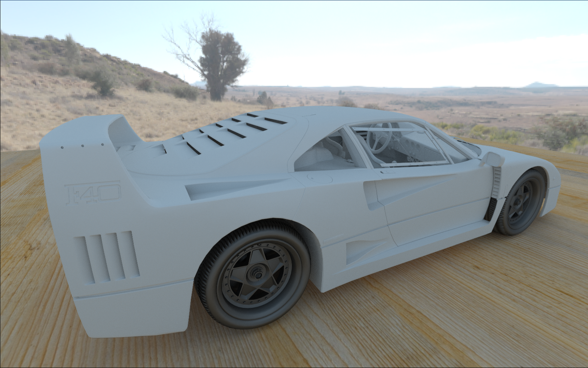

# LightBox
LightBox is a CPU Path Tracer that is currently being extended with a GPU path tracer using Vulkan.

## Features

#### Viewport Navigation

Holding down the `right mouse button` the:

- mouse rotates the camera
- `a` `w` `s` `d` keys move the camera
- `q` and `e` keys control camera elevation

#### Material types supported

- Lambertian
- Metal
- Glass
- Light

#### Custom obj loader

## Requirements

- An Nvidia RTX graphics card
- A Vulkan SDK installation (older versions may not work)

## How to build

This project is meant to be built using Visual Studio 2022

Platform used in development: Windows 10 x64

- Install Visual Studio 2022
- Install the Vulkan SKD
- Use `git clone https://github.com/edyson1202/LightBox --recursive` to clone the repository along with its submodules
- Make sure the `VULKAN_SDK` environment variable is set (this is required for the next step)
- Run the `GenerateProjectFiles.bat` script found in `scripts` directory to generate a Visual Studio solution and project files
- Build the `LightBox` project from within `Visual Studio 2022` and run the it

## Dependencies

#### Dear ImGui
Graphical user interface library for C++.

Used to create LightBox UI and Viewport.

[imgui](https://github.com/ocornut/imgui)

#### GLFW
Platform-independent API for creating windows.

[glfw](https://github.com/glfw/glfw)

#### glm
Mathematics library for graphics software.

Used along the internal math library, for comparison and development speed purposes.

[glm](https://github.com/g-truc/glm)

#### yaml-cpp
C++ YAML parser and emmiter.

Used for serialization and deserialization.

[yaml-cpp](https://github.com/TheCherno/yaml-cpp)

#### stb_image
Image loader.

Used to load textures and environment maps.

[stb_image](https://github.com/nothings/stb/blob/master/stb_image.h)

## Gallery

Ray Tracing with Vulkan

